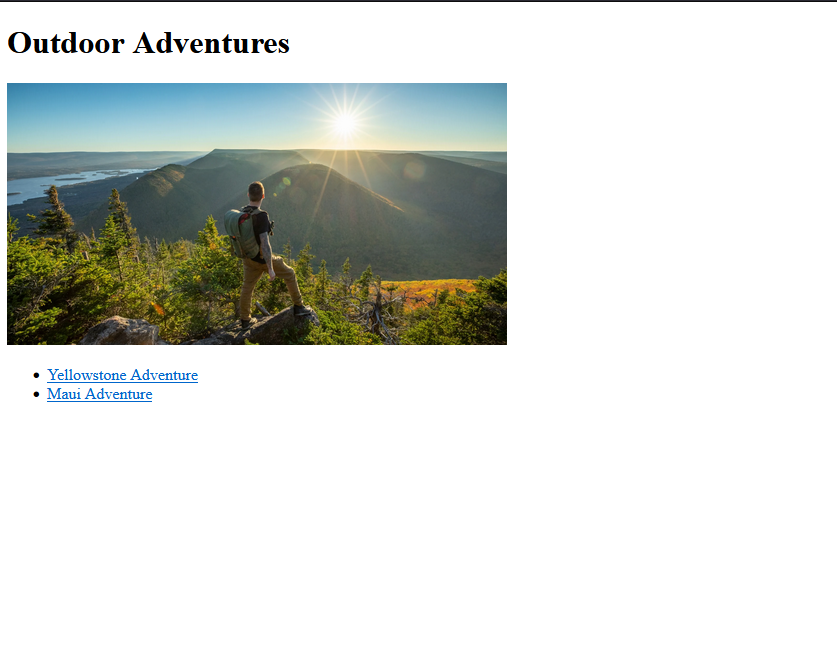
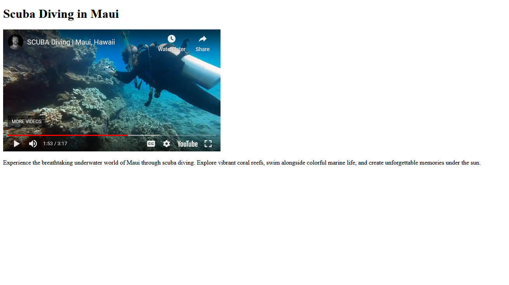
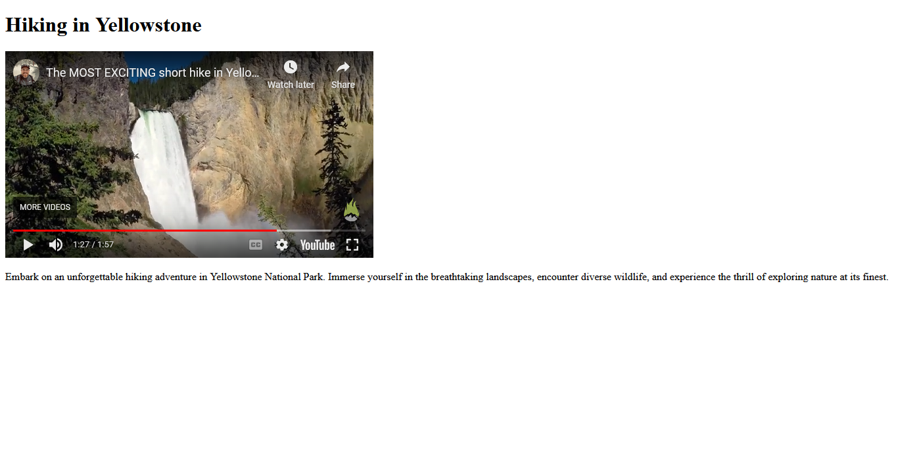

# More HTML

## Assignment: Create a Multi-Page Website for Outdoor Adventure Destinations

For this assignment, you will create a multi-page website that highlights various outdoor adventure destinations around the world. Your website should consist of interconnected pages, each showcasing a different adventure location.

  
  

     
    
  

### Instructions
#### Add the following changes to the landing page (index.html):  
- Display a header that says 'Outdoor Adventures' at the top of the page with a header tag (h1, h2, or h3)  
- Display a image related to 'Outdoor Adventures' under the header  
- Display links to both yellowstone.html and maui.html under the image

#### Add the following changes to the maui adventure page (mauiAdventure.html):  
- Display a header that says 'Scuba Diving in Maui' 
- Display [this video of scuba diving](https://www.youtube.com/watch?v=gHcnzz5Nyxg)  on the page with a iframe tag (iframe)
- Display a short summary that details what would make this adventure exciting and fun with a paragraph tag (p)

#### Add the following changes to the yellowstone adventure page (yellowstoneAdventure.html):  
- Display a header that says 'Hiking in Yellowstone' 
- Display [this video of hiking](https://www.youtube.com/watch?v=pe-7PyGgTYg)  on the page with a iframe tag (iframe)
- Display a short summary that details what would make this adventure exciting and fun with a paragraph tag (p)

Take a look at the Example folder for an idea of how the end result should look.